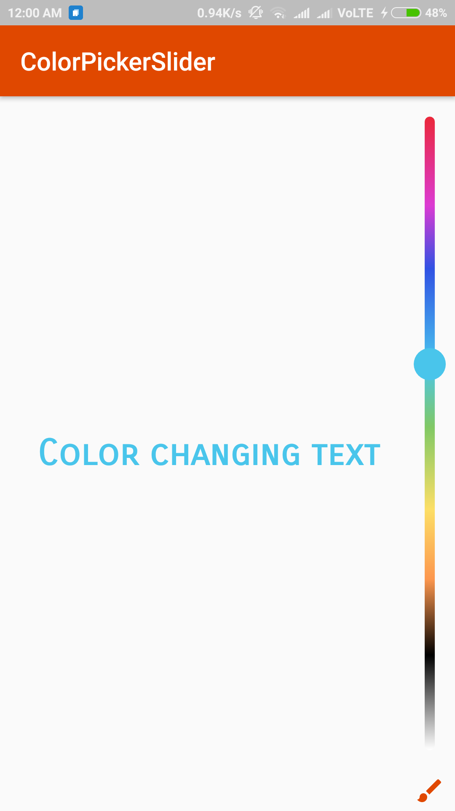
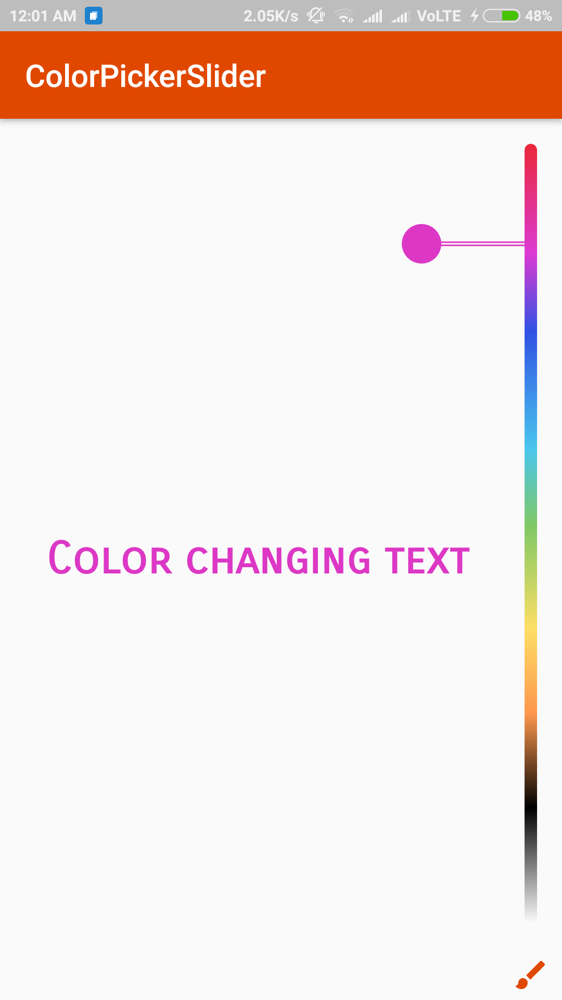

# ColorPickerSlider

##An android library for picking colors.

#Screenshot

 


#Usage
```
@Override
    protected void onCreate(Bundle savedInstanceState) {
        super.onCreate(savedInstanceState);
            setContentView(R.layout.activity_main);
            colorPicker=(ColorPicker)findViewById(R.id.color_picker);
            
            colorPicker.setColorPickerListener(new ColorPicker.ColorPickerListener() {
                @Override
                public void onBeganColorPicking() {
				//notifies start of color picking
                }

                @Override
                public void onColorValueChanged(int color) {
                     //notifies color change
                }

                @Override
                public void onFinishedColorPicking(int color) {
				//notifies final color after user finishes picking color
                }

                @Override
                public void onSettingsPressed() {
				//ignore
                }
            });


```


